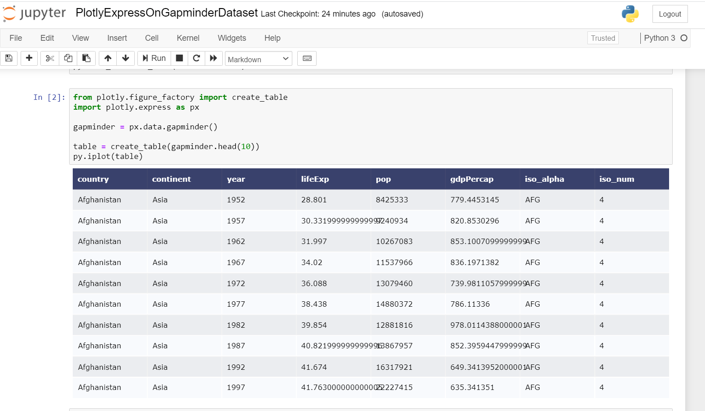
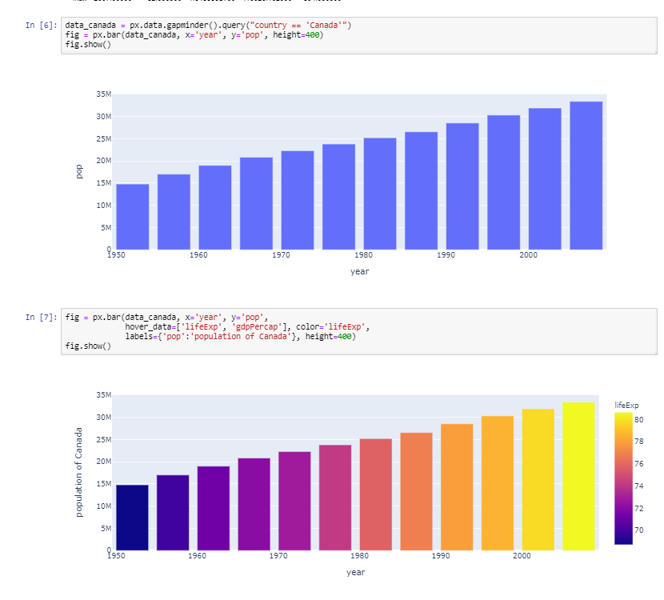
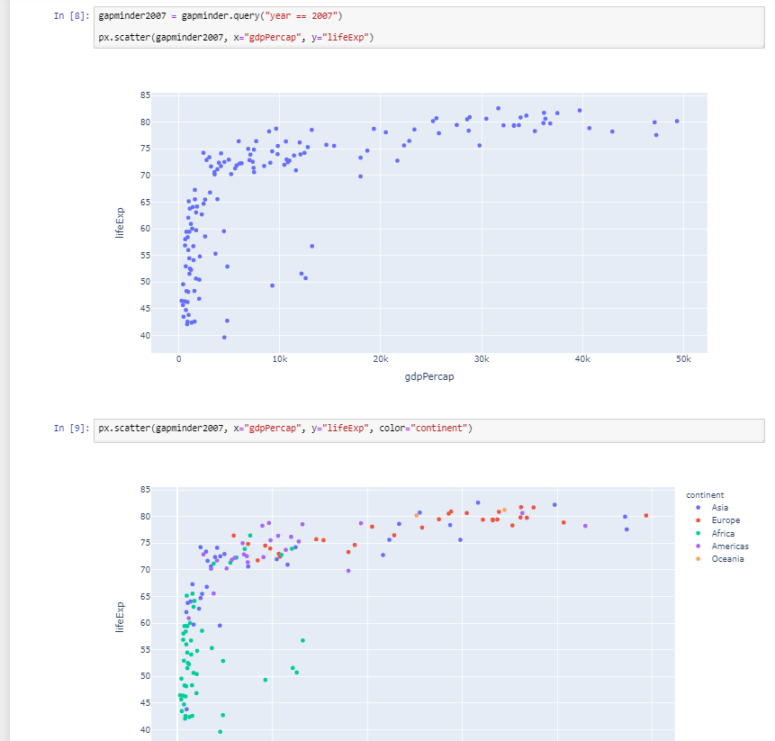
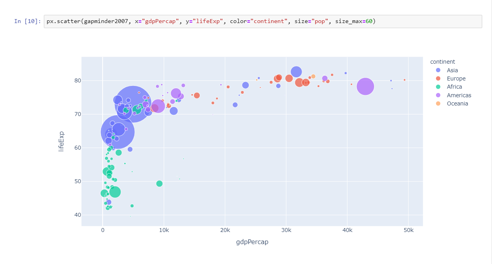
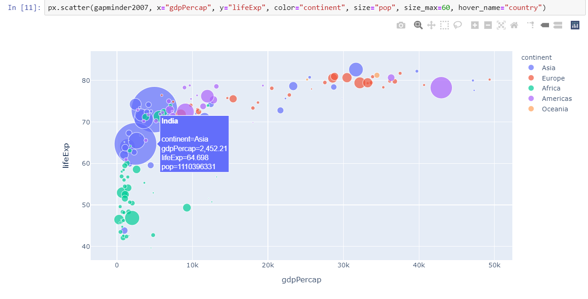
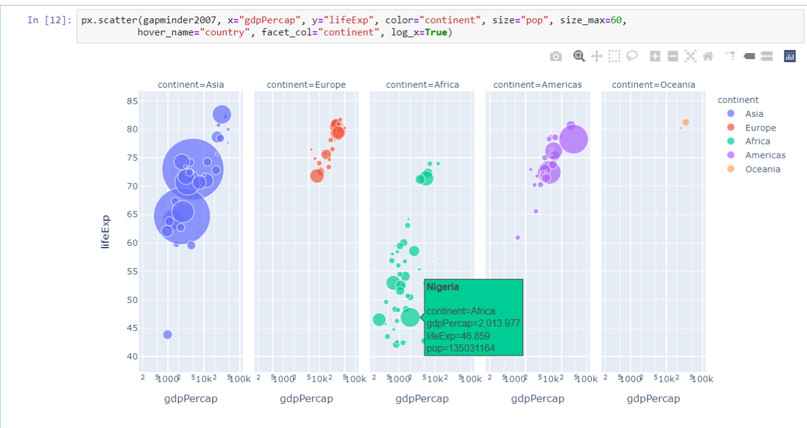
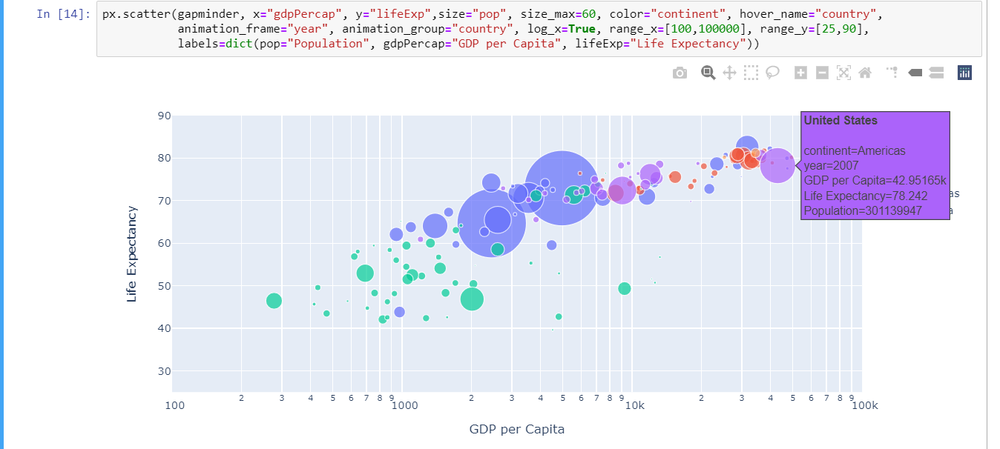
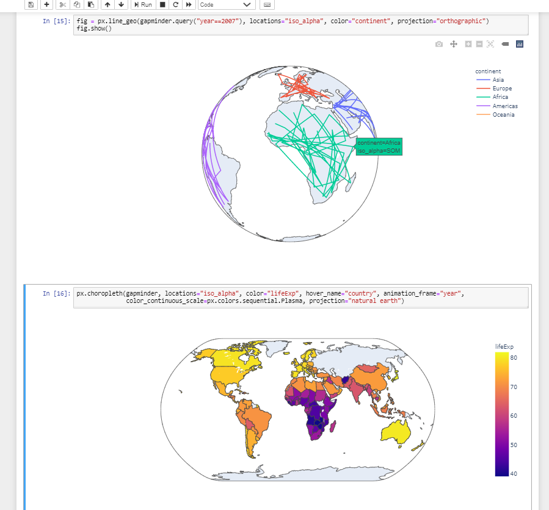
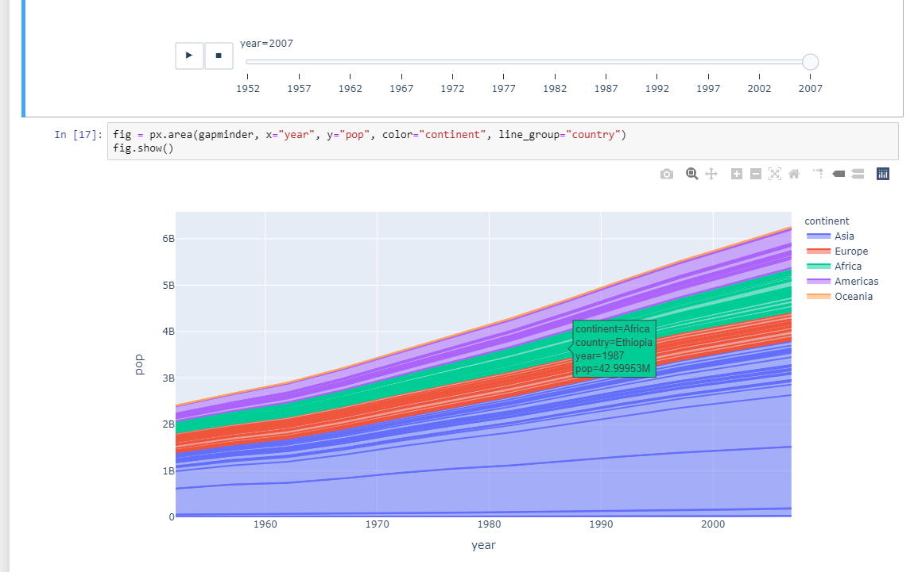

# As Github does not support plotly, I am adding Screenshots of output i have got

## gapminder dataset table
### 

## bar graph for Canada
### 

## scatter plot for gapminder dataset for year 2007
### 

## scatter plot for gapminder dataset for year 2007 with pop size
### 

## scatter plot for gapminder dataset with pop size which displays country when hovered over it
### 

## scatter plot for individual continents 
### 

## animation for gapminder dataset
### 

## gapminder data as orthographic and natural earth projection
### 

## line group plot of all country present in gapminder dataset
### 
